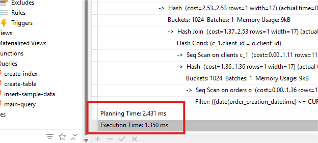
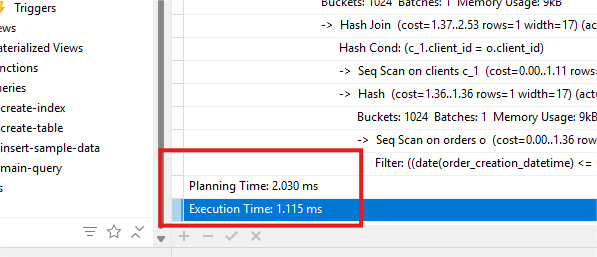

# SQL Reporting Assessment

This project generates a report showing daily lead and order activity by lead source over the last 30 days.

## Files

- `create-table.sql`  
  Creates the `LEADS`, `CLIENTS`, and `ORDERS` tables for the assessment.

- `insert-sample-data.sql`  
  Adds sample data to test and validate the query logic.

- `main-query.sql`  
  Contains the final SQL query that generates the 30-day report.

- `create-index.sql`  
  Adds indexes to speed up query execution time. See the analysis below for details.


---

## How to Run

1. Create PostgreSQL database:

    ```bash
    psql -U postgres -c "CREATE DATABASE nerdy_sql_test;"
    ````

2. Set up the schema and data:

    ```bash
    psql -U postgres -d nerdy_sql_test -f sql/create-table.sql
    psql -U postgres -d nerdy_sql_test -f sql/insert-sample-data.sql
    ```

3. Add indexes to improve performance:

    ```bash
    psql -U postgres -d nerdy_sql_test -f sql/create-index.sql
    ```

4. Run the report query:

    ```bash
    psql -U postgres -d nerdy_sql_test -f sql/main-query.sql
    ```

---

## Performance Analysis

Before optimization, the query execution time was around **1.350 ms**.

To improve performance, I created `create-index.sql` which adds indexes to:

* Date filtering columns: `lead_creation_datetime`, `order_creation_datetime`
* Join keys: `lead_id`, `client_id`
* Grouping column: `lead_source`

These indexes help PostgreSQL avoid full table scans and use faster indexed lookups.

**Before Optimization:**


**After Running Index Script:**
Execution time improved to **1.115 ms**, which is approximately **82.6% of the original time**.



This optimization makes the query more scalable for larger datasets.